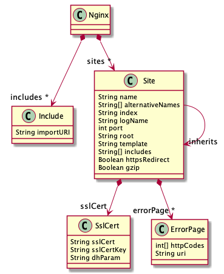
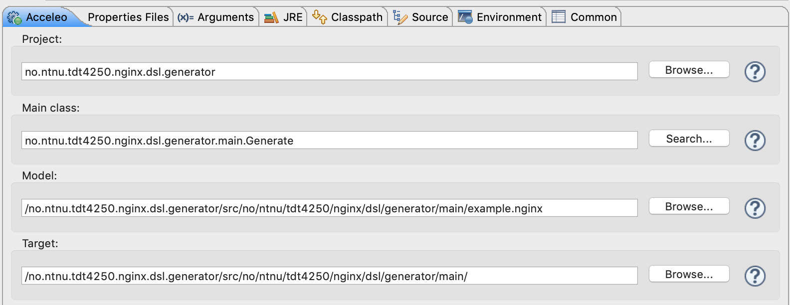
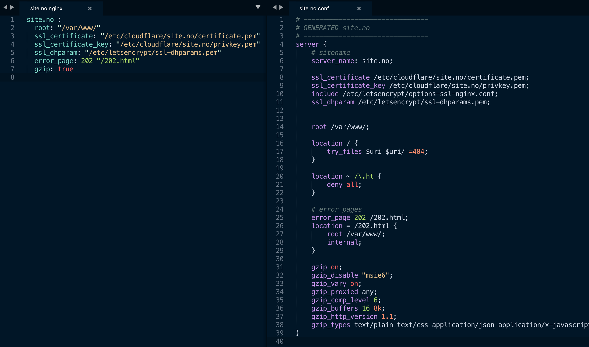
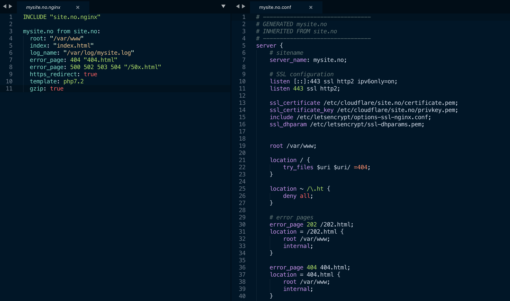
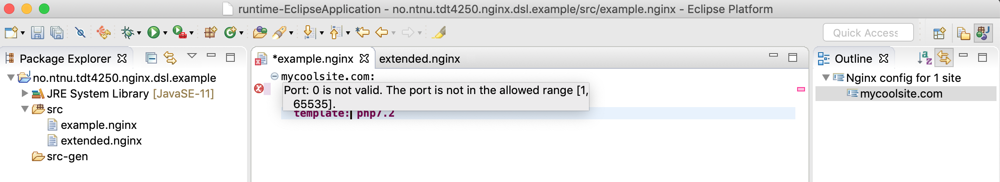

# Semester project - TDT4250: Advanced Software Design

[](https://hitsofcode.com/view/github/krissrex/ntnu-tdt4250-nginx-dsl)

Nginx config DSL for NTNU course TDT4250. 
#### Participants: 
- Kristian Rekstad
- Morten Stulen
- Johannes Røsvik
- Jonas Geschke

---

<!-- npx doctoc README.md -->
<!-- START doctoc generated TOC please keep comment here to allow auto update -->
<!-- DON'T EDIT THIS SECTION, INSTEAD RE-RUN doctoc TO UPDATE -->
**Table of Contents**

- [Building](#building)
  - [Maven](#maven)
  - [Eclipse](#eclipse)
- [Running](#running)
- [Development](#development)
  - [Project folders](#project-folders)
  - [Workflow](#workflow)
  - [Grammar](#grammar)
  - [Ecore Model](#ecore-model)
  - [Validators](#validators)
  - [Tests](#tests)
    - [Running the tests](#running-the-tests)
  - [Helpful links](#helpful-links)
- [Usage](#usage)
  - [Converting .nginx to .conf](#converting-nginx-to-conf)
  - [Writing new .nginx files](#writing-new-nginx-files)

<!-- END doctoc generated TOC please keep comment here to allow auto update -->

---

## Building

> This project uses [Java 11](https://adoptopenjdk.net/releases.html?variant=openjdk11&jvmVariant=hotspot).  

### Maven
`mvn clean package`

### Eclipse

1. Import all sub-projects into eclipse
2. Run the `.dsl/src/*/GenerateNginx.mwe2` as a workflow (right click it -> Run as)

## Running

To start the IDE for writing DSL: 

1. Build in eclipse
2. Right-click `.ide` and Run as: `Eclipse Application`
3. Open the example project in `examples\example.nginx.mywebsite` in this new eclipse, or create a new project
4. Create a `.nginx` file
5. Start writing.

> An explanation with screenshots can be found [further down](#writing-new-nginx-files)

To generate a config:

1. Build in eclipse
2. Find `generate.mtl` in `.generator/src/*/main/generate.mtl`.
3. Right click `generate.mtl` and Run as: `Launch Acceleo application`
4. Edit the run configuration:
  1. Project: `no.ntnu.tdt4250.nginx.dsl.generator`
  2. Main class: `no.ntnu.tdt4250.nginx.dsl.generator.main.Generate`
  3. Model: *your .nginx file you created* (or the example file: `/no.ntnu.tdt4250.nginx.dsl.generator/src/no/ntnu/tdt4250/nginx/dsl/generator/main/mysite.no.nginx`)
  4. Target: an output folder for generated files, like `/no.ntnu.tdt4250.nginx.dsl.generator/target/generated-nginx-mysite`
  5. Configuration > Runner: `Java Application`
5. Apply and Run
  * If it says the configuration does not exist, just try to run it again

> An explanation with screenshots can be found [further down](#converting-nginx-to-conf)

---

## Development

### Project folders

| Folder name   | Description                                                                                           |
| ------------- | ----------------------------------------------------------------------------------------------------- |
| .generator    | Acceleo model-to-text                                                                                 |
| .generator.ui | Acceleo Launcher UI project                                                                        |
| .dsl          | The grammar definition and all language-specific components (parser, lexer, linker, validation, etc.) |
| .ide          | Platform-independent IDE functionality (e.g. services for content assist)                             |
| .target       | Target platform configurations                                                                        |
| .tests        | xtext tests                                                                                           |
| .ui           | xtext ui                                                                                              |
| .ui.tests     | Unit tests for the Eclipse editor                                                                     |

### Workflow

1. Write the xtext grammar and EMF in `.dsl/src/*/Nginx.xtext`
2. Generate language artifacts by running the `.dsl/src/*/GenerateNginx.mwe2` workflow (right-click)
3. Run the generated eclipse plug-in from `.ui` folder
4. Write in our DSL with this new eclipse window. Open an example project for this
5. Write Acceleo generator code using the DSL EMF model
6. Use the xtext code to load a EMF model instance from the DSL file and hand it to Acceleo

### Grammar

This is the xtext grammar that will be used to generate the Ecore model:


### Ecore Model

This is the model generated from the xtext grammar:



The model consists of the main `Nginx` consisting of any number of sites. The sites themselves contain a number of attributes, and two EClasses: `SslCert` and `ErrorPage`.

The sites can have several `alternative names` and several `error pages`. The error pages contain a list of `error codes` that link to a specific `uri`. Each site has a `SSL Certifiate` that can be reused for other domains or subdomains.

The model also keeps track of other referenced nginx-files in the includes attributes. All sites in those files can be referenced by inheriting from them.

### Validators

There are three validators `NginxValidator`, `NginxSslValidator`, `NginxErrorValidator` and `NginxIncludeValidator` corresponding to the model: `Site`, `SslCert`, `ErrorPage` and `Include`.

The main validator uses "composed checks" to include the two others:

`@ComposedChecks(validators = #[NginxSslValidator, NginxErrorValidator, NginxIncludeValidator])`

These validators then validate the model and throws an error if something is incorrect in the input. Every field in the model is checked and validated - mostly through regex.

### Tests

The tests are located in `no.ntnu.tdt4250.tests`. For each object in the model `Site`, `SslCert` and `ErrorPage`, there is a corresponding `.xtend` test file. In addition to this, there is a `Parsing` test and a `UnquotedStringValueConverter` test.

The tests take in an input - for example for testing the `site` model;

```
mycoolsite.com:
    port: 3000
    index: "index.html index.php"
    template: php7.2
    https_redirect: true
    error_page: 404 "/404.html"
    error_page: 500 501 502 "/50x.html"
    ssl_certificate: "/etc/somepath/cert.pem"
    ssl_certificate_key: "/etc/somepath/cert_key.pem"
    ssl_dhparam: "/etc/somepath/dhparam.pem"
    log_name: "/var/log/nginx/access.log"
    include: "fastcgi_params"
```

and parses it using the `ParseHelper`. The resourceValidator then validates the result using the validators implemented in `no.ntnu.tdt4250.nginx.dsl`. Any issues (errors or warnings) are printed to the console in addition to failing the test.

#### Running the tests

Right click on the `no.ntnu.tdt4250.tests` project and select `Run as -> JUnit Test`

Alternatively, use `mvn test` (or `mvn --offline test` to skip downloading dependencies/p2 indexes)

### Helpful links

- Official Xtext docs https://www.eclipse.org/Xtext/documentation/102_domainmodelwalkthrough.html
- NTNU wiki https://www.ntnu.no/wiki/display/tdt4250/Setup+for+Xtext
- TDT4250 example repo https://gitlab.stud.idi.ntnu.no/TDT4250/examples/tree/master/tdt4250.ra.xtext2
- Whitespace-aware languages: https://www.eclipse.org/Xtext/documentation/307_special_languages.html
- Testing Xtext Languages https://www.eclipsecon.org/france2015/sites/default/files/slides/presentation.pdf (there is also a video on this)
- Terminals VS data types https://zarnekow.blogspot.com/2012/11/xtext-corner-6-data-types-terminals-why.html


---

## Usage
### Converting .nginx to .conf

1. Right click the `GenerateNginx.mwe2` inside `no.ntnu.tdt4250.nginx.dsl` and select `Run as -> MWE2 Workflow`
2. Right click the `generate.mtl` inside `no.ntnu.tdt4250.nginx.dsl.generator` and select `Run Configurations...`. Make sure the `.mtl` is updated. If it shows an error, change something (like add a space) and save again to refresh it. Use the following run coniguration:



3. You can change the `example.nginx` to whatever `.nginx` file you want. The results are shown below:



A simple conversion from our YAML-based language on the left to a working Nginx config file on the right. 



A conversion with inheritance, where all the configurations from the previous example is applied unless they are overwritten.


### Writing new .nginx files

To write new `.nginx` files you want to utilize the features of xtext such as autocompletion and error handling. This is done by starting a new eclipse project.

1. Right click the `no.ntnu.tdt4250.nginx.dsl.ui` project and select `Run as -> Eclipse Application`
2. Create a new Java Project
3. Create `.nginx` files and enjoy the autocomplate and validation inside the editor



#### Available directives
Following nginx directives are available in our custom DSL: 
 * `port` (Number): Specifies a from which the website should grab its content (same as in nginx conf)
 * `root` (FilePath): Specifies a root directory from which the website should grab its content (same as in nginx conf)
 * `log_name` (FileName): Defines the name of the log-file. 
 * `template`: Defines what template should used (currently `php7.2` and `php5.6` are available)
 * `include`: 
 * `https_redirect` (Boolean):  Flag, if http traffic should be redirected to HTTPS.
 * SSL:
    * `ssl_certificate` (FilePath): Defines which  SSL certificate should be used for HTTPS.
    * `ssl_certificate` (FilePath): Defines the key for the Certificate.
    * `ssl_dhparam` (FilePath): Defines the DHParam for SSL. 
 * `error_page` (Number+ FileName): Defines the displayed file for http errors (same as in nginx conf)
 * `gzip` (Boolean): Flag, if the response should be gziped.

 #### Additional Features
 * Using the `default` directive as a website name will create a default nginx config.
 ```nginx
default:
  port: 8080
 ```
 * Include other nginx configurations to reference them. With the `from` directive you can inherit a configuration and extend them.
 ```nginx
INCLUDE "othersite.nginx"

mysite.no from othersite.no: 
  port: 9090
  error_page: 500 501 /50x.html
```

