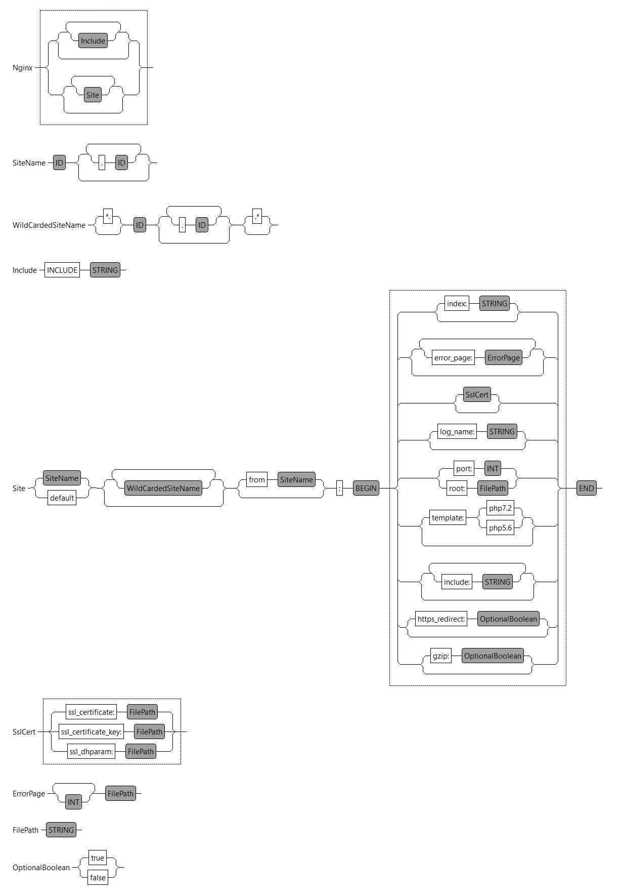

# ntnu-tdt4250-nginx-dsl

[](https://hitsofcode.com/view/github/krissrex/ntnu-tdt4250-nginx-dsl)

Nginx config DSL for NTNU course TDT4250

## Project folders

| Folder name | Description                                                                                           |
| ----------- | ----------------------------------------------------------------------------------------------------- |
| .generator  | Acceleo model-to-text                                                                                 |
| .dsl        | The grammar definition and all language-specific components (parser, lexer, linker, validation, etc.) |
| .ide        | Platform-independent IDE functionality (e.g. services for content assist)                             |
| .target     | no idea, xtext. Possibly maven stuff.                                                                 |
| .tests      | xtext tests                                                                                           |
| .ui         | xtext ui                                                                                              |
| .ui.tests   | Unit tests for the Eclipse editor                                                                     |

## Workflow

1. Write the xtext grammar and EMF in `.dsl/src/*/Nginx.xtext`
2. Generate language artifacts by running the `.dsl/src/*/GenerateNginx.mwe2` workflow (right-click)
3. Run the generated eclipse plug-in from `.ui` folder
4. Write in our DSL with this new eclipse window. Open an example project for this
5. Write Acceleo generator code using the DSL EMF model
6. Use the xtext code to load a EMF model instance from the DSL file and hand it to Acceleo

## Grammar



## Tests

The tests are located in `no.ntnu.tdt4250.tests`. For each object in the model `Site`, `SslCert` and `ErrorPage`, there is a corresponding `.xtend` test file. In addition to this, there is a `Parsing` test and a `UnquotedStringValueConverter` test.

The tests take in an input - for example for testing the `site` model;

```
mycoolsite.com:
    port: 3000
    index: "index.html index.php"
    template: php7.2
    https_redirect: true
    error_page: 404 "/404.html"
    error_page: 500 501 502 "/50x.html"
    ssl_certificate: "/etc/somepath/cert.pem"
    ssl_certificate_key: "/etc/somepath/cert_key.pem"
    ssl_dhparam: "/etc/somepath/dhparam.pem"
    log_name: "/var/log/nginx/access.log"
    include: "fastcgi_params"
```

and parses it using the `ParseHelper`. The resourceValidator then validates the result using the validators implemented in `no.ntnu.tdt4250.nginx.dsl`. Any issues (errors or warnings) are printed to the console in addition to failing the test.

### Validators

There are three validators `NginxValidator`, `NginxSslValidator` and `NginxErrorValidator` corresponding to the model: `Site`, `SslCert` and `ErrorPage`.

The main validator uses "composed checks" to include the two others:

`@ComposedChecks(validators = #[NginxSslValidator, NginxErrorValidator])`

These validators then validate the model and throws an error if something is incorrect in the input. Every field in the model is checked and validated - mostly through regex.

### Running the tests

Right click on the `no.ntnu.tdt4250.tests` project and select `Run as -> JUnit Test`

## Helpful links

- https://www.eclipse.org/Xtext/documentation/102_domainmodelwalkthrough.html
- https://www.ntnu.no/wiki/display/tdt4250/Setup+for+Xtext
- https://gitlab.stud.idi.ntnu.no/TDT4250/examples/tree/master/tdt4250.ra.xtext2
- Whitespace-aware languages: https://www.eclipse.org/Xtext/documentation/307_special_languages.html
- Testing https://www.eclipsecon.org/france2015/sites/default/files/slides/presentation.pdf (there is also a video on this)
- terminals vs data types https://zarnekow.blogspot.com/2012/11/xtext-corner-6-data-types-terminals-why.html
